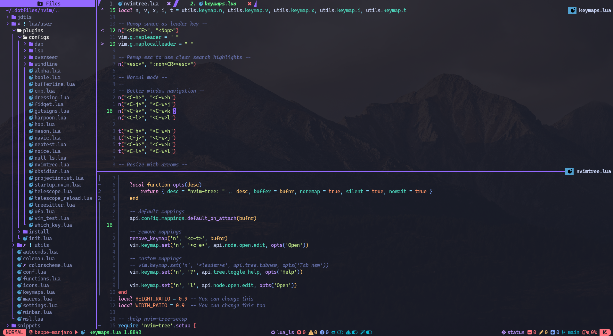

# My nvim configs


> README in WIP...

*Read this in other languages: 🇺🇸[English](README.md), 🇧🇷[Portuguese](README.pt-br.md).*

Hello, I'm Giuseppe Matheus (Beppe) a software engineer from Brazil. 👋

I created this configuration to help others achieve a full workflow using Neovim. I have tried NvChad, Alpha, and other configurations, but I always encounter the same problem: I struggle to understand their configuration architecture, and I feel unable to make changes without reading extensive documentation on how things are organized.

In the past, I wrote many configuration files, but now I want to share my experience with you. My goal is to keep things as simple as possible, so that any user who knows Lua and Neovim can make changes without heavy abstraction."

I work daily with Python, Java, Lua, Golang, Javascript, Typescript, HTML/YAML/Json/XML, Markdown, Terraform, Ansible, and Shell.

Let me know if you have any questions, other lsp help, or suggestions, free to [open an
issue](https://github.com/GiuseppeMP/my-nvim-config/issues/new).

## Demo



## ⚡️ Dependencies and Requirements

* Neovim >= 0.9.0 or Nightly
* macOS (`homebrew`)
* macOS (`open`), Linux (`xdg-open`) or Windows (`powershell.exe start explorer.exe`)

This configuration has plugins that relies on some external thiNithlyngs.

### 🍺 Homebrew Packages

```sh
brew install safe-rm
brew install gnu-sed
brew install fd
brew install fzf
brew install npm
brew install gpg
brew install go
```

## Language Server, Linters, DAPs and Formatters

You can install by yourself, but I recommend using asdf.

You can install any of these things using `:Mason`.

The list of the LSP's supported by `Mason` is documented at [LSP Configurations](https://github.com/neovim/nvim-lspconfig/blob/master/doc/server_configurations.md)

Depending which LSP you want to use, you can install the language binaries using `asdf`

## The Multiple Runtime Version Manager 

Install asdf for setup languages and runtimes needed for LSPs.

[asdf](https://asdf-vm.com/guide/getting-started.html#_2-download-asdf)

### Java

```sh
# add plugin
asdf plugin-add java https://github.com/halcyon/asdf-java.git

# install versions
asdf install java corretto-8.342.07.1
asdf install java corretto-11.0.16.9.1
asdf install java zulu-14.29.23
asdf install java corretto-17.0.4.9.1
asdf install java corretto-19.0.2.7.1

# activate
asdf global java corretto-19.0.2.7.1
```

### Python

```sh
# add python plugin
asdf plugin-add python

# install versions
asdf install python 2.7.18
asdf install python 3.10.5

# activate
asdf global python 3.10.5 
```

I'm personally used `pipenv` check out in [pipenv](https://pipenv.pypa.io/en/latest/)

```sh
pip install --user pipenv
```
