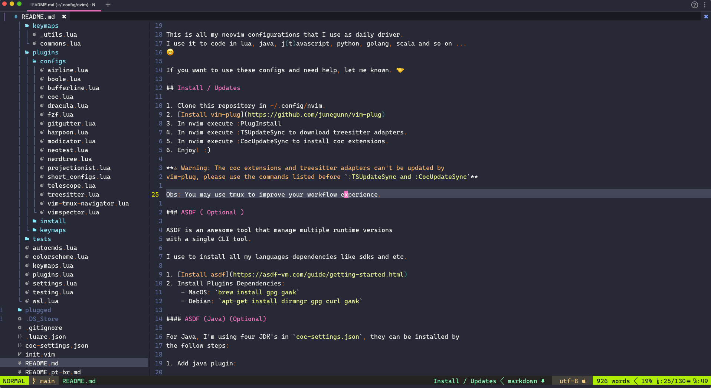

# Minhas Configurações de Neovim

*Read this in other languages: 🇺🇸[English](README.md), 🇧🇷[Portuguese](README.pt-br.md).*

Olá, Eu sou Giuseppe Matheus, (Beppe). 👋

Este repositório são todas as minhas configurações de neovim que
uso diariamente em praticamente tudo que faço.

Atualmente eu utilizo nvim para codar lua, java, t(j)avascript, python, golang,
scala e por aí vai. 😄

Se você for utilizar essas configs e precisar de ajuda, pode contar comigo!
Terei o prazer de compartilhar como funciona meu workflow.

Eu sou brasileiro também e por isso criei o README.pt-br.md, para
ser acessível para pessoas que não tem familiaridade com Inglês. 🤝

**Como fica essa config:**

## Instalação e Atualizações

1. Clone esse repositório em in ~/.config/nvim.
2. [Instale o vim-plug](https://github.com/junegunn/vim-plug)
3. Dentro do nvim execute :PlugInstall
4. Dentro do nvim execute :TSUpdateSync para baixar os adapters do treesitter.
5. Dentro do nvim execute :CocUpdateSync para instalar as extensões do coc-vim.
6. Sucesso! 🤞

**⚠ Importante: As atualizações do coc-vim e treesitter precisam ser feitas com os comandos acima, elas não são atualizadas pelo vim-plug.**

Obs: Recomendo fortemente utilizar tmux, algumas das minhas configurações
foram feitas para serem integradas com tmux.

### ASDF ( Opcional )

ASDF é uma ferramenta poderosa, que consegue gerenciar diferentes
runtimes, ambientes e versões em uma única CLI.

Eu uso asdf para instalar todas as sdks, servidores e linguagens que uso
para trabalhar.

1. [Instalar asdf](https://asdf-vm.com/guide/getting-started.html)
2. Instalar algumas dependências dependendo do seu sistema operacional:
    - MacOS: `brew install gpg gawk`
    - Debian: `apt-get install dirmngr gpg curl gawk`

Todas as instações do asdf ficam na pasta `~/.asdf/installs/{plugin-name}`.

#### Instalar java com asdf. (Opcional)

Para codar java com essa config é necessário instalar as jdks que estão sendo
usadas pelo `coc-settings.json`, você pode fazer isso com asdf seguindo
os passos abaixo:

1.Adicione o plugin de java ao asdf.

    `asdf plugin-add java https://github.com/halcyon/asdf-java.git`

2.Baixe todas as jdks necessárias:

- `asdf install java  corretto-11.0.16.9.1`
- `asdf install java  zulu-14.29.23`
- `asdf install java  corretto-17.0.4.9.1`
- `asdf install java  corretto-8.342.07.1`

3.Você pode utilizar qualquer uma delas como `java` global. (Opcional)

- `asdf global java corretto-11.0.16.9.1`

#### Instalar nodejs com asdf. (Required)

Alguns plugins dependem de um nodejs instalado, se você já possuí um nodejs
você pode ignorar essa etapa.

Você pode instalar o nodejs do jeito que você quiser, abaixo é como eu faço isso, 
utilizando o asdf.

1. Adicione o plugin de nodejs ao asdf.

`asdf plugin add nodejs https://github.com/asdf-vm/asdf-nodejs.git`

2.Baixe todos as versões que você desejar, eu utilizo lts-gallium.

`asdf install nodejs lts-gallium`

3.É preciso ter um nodejs disponível, caso você não tenha, e está
seguindo os passos desse README.md execute o comando abaixo:

`asdf global nodejs lts-gallium`

Os comandos `nodejs` e `npm` no terminal devem estar funcionando.

## Dependencies

Alguns plugins possuem dependências de pacotes externos como rg.
Abaixo a lista do que precisa ser instalado.

- [ripgrep](https://github.com/BurntSushi/ripgrep)
- [asdf](https://asdf-vm.com/)
- [nerdfonts](https://www.nerdfonts.com/) (For icons and ligatures.)
- [node-js](https://nodejs.org/en/)

## Plugins Index and Modules

All plugins are listed in a table in the `lua/user/plugins/install/_list.lua`
module, this table is iterated by `lua/user/plugins/install/with-vimplug.lua`
and installed by vim-plug.

If you want, you may rewrite the `with-vimplug.lua` to install with your favorite
plugin manager instead of vim-plug.

- The `name` property is the plugin itself.
- The `cfg` property hold the vim-plug hooks and configs.

## Plugins

This configuration use the set of plugins listed below:

|  Name      |    description       |  docs  |
| ------------- |-------------  | ------- |
|    nvim-treesitter/nvim-treesitter    |     Tree-sitter is a parser generator tool and an incremental parsing library. It can build a concrete syntax tree for a source file and efficiently update the syntax tree as the source file is edited. | [github](https://github.com/nvim-treesitter/nvim-treesitter) |
| tpope/vim-repeat | Repeat plugin commands using dot | [github](https://github.com/tpope/vim-repeat) |
| tpope/vim-surround | Fast add, remove or change surrounds | [github](https://github.com/tpope/vim-surround) |
| powerline/powerline-fonts | Package of powerline fonts for nvim | [github](https://github.com/powerline/powerline-fonts) |
| easymotion/vim-easymotion | Powerful and precise navigation tool | [github](https://github.com/easymotion/vim-easymotion) |
| tpope/vim-commentary | Comments made easy | [github](https://github.com/tpope/vim-commentary) |
| p00f/nvim-ts-raindow  | Treesitter rainbow effect | [github](https://github.com/p00f/nvim-ts-raindow) |
| kyazdani42/nvim-web-devicons | Web Devicons | [github](https://github.com/kyazdani42/nvim-web-devicons) |
| moll/vim-bbye | Close buffers without accidentaly leaving vim | [github](https://github.com/moll/vim-bbye) |
| akinsho/bufferline |  Niceee tabs | [github](https://github.com/akinsho/bufferline) |
| vim-airline  | Beautiful and fully customizable status bar | [github](https://github.com/vim-airline) |
| vim-airline-themes | Awesome status bar themes | [github](https://github.com/vim-airline-themes) |
| awesome-vim-colorscheme | Package of vim themes | [github](https://github.com/awesome-vim-colorscheme) |
| artanikin/vim-synthwave84 | I love synthwave84 sometimes I switch to it! | [github](https://github.com/artanikin/vim-synthwave84) |
| vim-devicons | Devicons | [github](https://github.com/vim-devicons) |
| Mofiqul/dracula | A simple and awesome Dracula theme, for whoever likes. | [github](https://github.com/Mofiqul/dracula) |
| unblevable/quick-scope | Highlight jumps when using `F,f,t,T` | [github](https://github.com/unblevable/quick-scope) |
| scrooloose/nerdtree | A File Explorer | [github](https://github.com/scrooloose/nerdtree) |
| tpope/vim-fugitive | All git commands available throught `:G` | [github](https://github.com/tpope/vim-fugitive) |
| junegunn/fzf | Awesome fuzzy finder plugin | [github](https://github.com/junegunn/fzf) |
| nvim-telescope/telescope | Awesome fuzzy finder lists plugin | [github](https://github.com/nvim-telescope/telescope) |
| honza/vim-snippets | Powerfull package of snippets | [github](https://github.com/honza/vim-snippets) |
| neoclide/coc.vim | LSP Support, extensions, and more. | [github](https://github.com/neoclide/coc.vim) |
| iamcco/markdown-preview.nvim | Edit markdowns with livereload with `<C-m><C-m>` | [github](https://github.com/iamcco/markdown-preview.nvim) |
| preservim/tagbar | A nice tagbar outline  | [github](https://github.com/preservim/tagbar) |
| nvim-lua/plenary.nvim | A nice lua library of utils functions | [github](https://github.com/nvim-lua/plenary.nvim) |
| vim-test/vim-test | Run tests in very different languages | [github](https://github.com/vim-test/vim-test) |
| nvim-neotest/neotest | A new plugin for tests written in lua | [github](https://github.com/nvim-neotest/neotest) |
| nvim-neotest/neotest-vim-test | An adapter to neotest use vim-test adapters | [github](https://github.com/nvim-neotest/neotest-vim-test) |
| nvim-neotest/neotest-plenary | Functions dependencies of neotest | [github](https://github.com/nvim-neotest/neotest-plenary) |
| kana/vim-vspec | Testing framework for vim script | [github](https://github.com/kana/vim-vspec) |
| antoinemadec/FixCursorHold.nvim | Fix some cursor interactions | [github](https://github.com/antoinemadec/FixCursorHold.nvim) |
| tpope/vim-projectionist | Alternate between to related files like code of implementation and tests | [github](https://github.com/tpope/vim-projectionist) |
| puremourning/vimspector | Debugger interface for many adapters | [github](https://github.com/puremourning/vimspector) |
| mfussenegger/nvim-dap | Debugger adapters for nvim | [github](https://github.com/mfussenegger/nvim-dap) |
| neovim/nvim-lspconfig | Utility for LSP Configurations | [github](https://github.com/neovim/nvim-lspconfig) |
| ThePrimeagen/harpoon | Nice marker file plugin, for fast navigation `ma`, `mm`| [github](https://github.com/ThePrimeagen/harpoon) |
| psliwka/vim-smoothie | Make `C-d`, `C-up` smoothie for human eyes | [github](https://github.com/psliwka/vim-smoothie) |
| voldikss/vim-floaterm | Awesome floating terminals | [github](https://github.com/voldikss/vim-floaterm) |
| Sirver/ultisnips | Awesome package of snippets | [github](https://github.com/Sirver/ultisnips) |
| honza/vim-snippets | Another awesome package of snippets, but extensable. | [github](https://github.com/honza/vim-snippets) |
| airblade/vim-gitgutter | Git status in signcolumn, very useful| [github](https://github.com/airblade/vim-gitgutter) |
|skywind3000/asyncrun.vim | Awesome interface to run background tasks | [github](https://github.com/skywind3000/asyncrun.vim) |
| christoomey/vim-tmux-navigator | Navigate between tmux terminals and neovim with `<C-l,k,j,h>` | [github](https://github.com/christoomey/vim-tmux-navigator) |
| melkster/modicator | Highlight the number of the cursor line | [github](https://github.com/melkster/modicator) |
| toppair/peek.nvim | Another awesome Markdown Previewer | [github](https://github.com/toppair/peek.nvim) |
| nat-418/boole.nvim | Rotate custom values like `false` <-> `true` using `<C-x,a>` | [github](https://github.com/nat-418/boole.nvim) |
|
